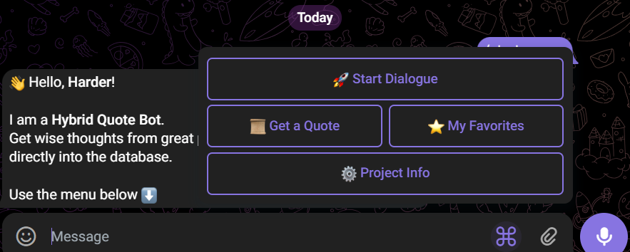
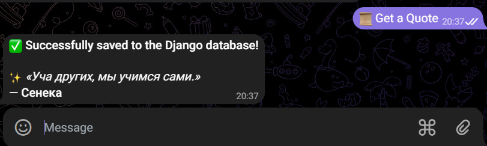
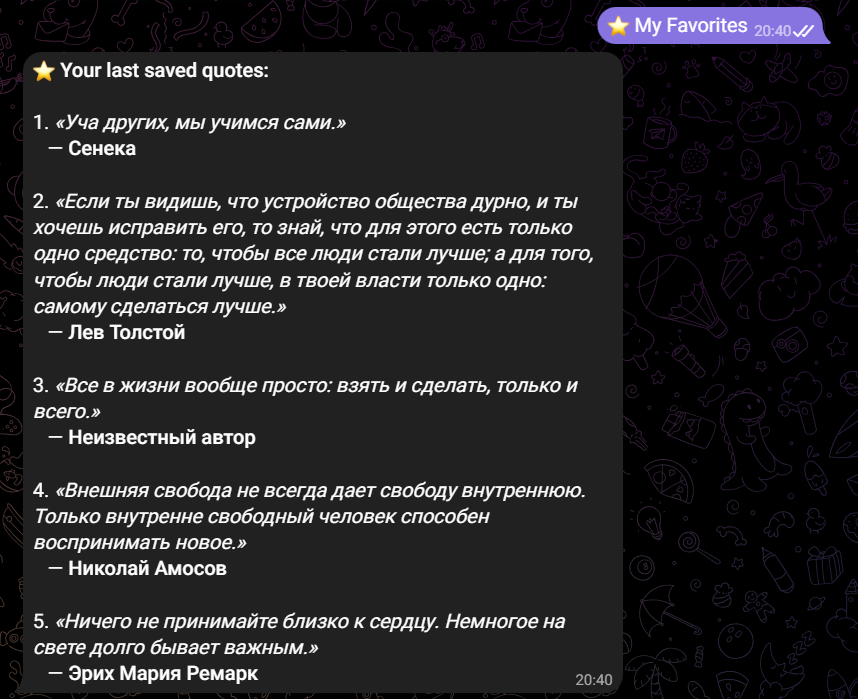
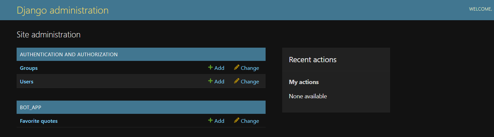

# Hybrid Telegram Bot for Finding and Storing Quotes

## Project Description
This project is a **Hybrid Chatbot** developed as a final project for the "Python Programming" course. The bot is fully integrated with the Django web framework, utilizes an external REST API to fetch random inspirational quotes, and stores individual user data directly into an SQLite database via Django ORM.

---

## 🛠 Technical Stack
- **Programming Language:** Python 3.13
- **Backend Framework:** Django (Database management, migrations, and built-in Admin Panel)
- **Bot Library:** python-telegram-bot (v20+ Asynchronous)
- **Database:** SQLite (managed via Django ORM)
- **External API:** Forismatic API (integrated via the `requests` library)

1. Activate the Virtual Environment
Open your terminal in the project root directory and run the following command to activate your virtual environment:

Bash:
# For Windows (Command Prompt / Power Shell):
.\venv\Scripts\activate

2. Install Required Dependencies
Install all required libraries and packages specified in the requirements.txt file:

Bash:
pip install -r requirements.txt

3. Run Database Migrations
Create the necessary database tables in SQLite to enable the user information storage feature:

Bash:
python manage.py makemigrations bot_app
python manage.py migrate

4. Create a Superuser (Admin Account)
Create an administrative account to access and view user data inside the Django web interface:

Bash:
python manage.py createsuperuser

(Follow the terminal prompts to set up your username, email, and password)

5. Launch the Telegram Bot
Make sure your bot token from @BotFather is correctly pasted inside the run_bot.py file, then run:

Bash:
python manage.py run_bot

6. Run the Django Web Server
To view saved user data and analytics through your browser, stop the bot (Ctrl + C) and start the local web server:

Bash:
python manage.py runserver
Open your browser and navigate to: http://127.0.0.1:8000/admin/

---

## Bot Workflow & Examples of Work

### Scenario 1: Fetching and Saving a Random Quote
* **Action:** The user presses the `Get a Quote` button.
* **Result:** The bot makes an API call and returns a random quote with a custom inline button.
* **Action:** The user presses the `Save to Django` inline button.
* **Result:** The database stores the record, and the bot updates the interface text to confirm the entry.

### Scenario 2: Retrieving User's Favorites List
* **Action:** The user presses the `My Favorites` button.
* **Result:** The bot queries the database via Django ORM using the user's Telegram ID and returns up to 5 last saved quotes in a clean numbered list.

### Scenario 3: Interacting with Easter Eggs (Keywords)
* **Action:** The user types `hello`, `help`, or `joke`.
* **Result:** The bot triggers a contextual, hardcoded message without calling external APIs.

---

## 🖼 Interface Screenshots

Here are the visual representations of the working system:

### 1. Main Interaction Menu

### 2. Fetching and Saving a Quote

### 3. User's Favorites Display

### 4. Backend Administration Panel (Django Storage Verification)
